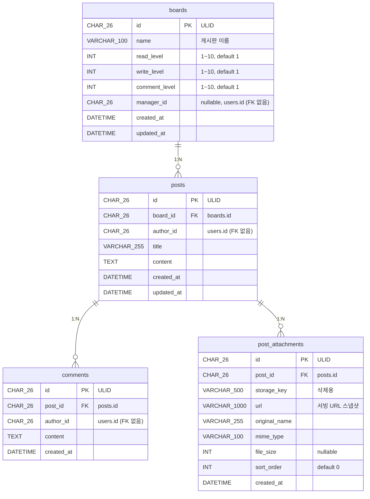

# 게시판 CMS 관련 테이블 명세

> **작성일**: 2026-06-03
> **스키마 파일**: `prisma/schema.prisma` (※ 이 문서는 게이트2 검토용 — 아직 schema.prisma 미적용)

---

## 설계 배경

그누보드 계열 게시판 CMS의 콘텐츠 도메인(`board` BC). 게시판마다 읽기/쓰기/댓글 **레벨 문턱**을 두고, 회원 레벨(`users.level`)과 비교해 접근을 제어한다. 게시판마다 **단일 관리자**(`manager_id`)를 두어 글·댓글 운영(삭제)을 위임한다.

### BC 경계 원칙 (FK 정책)

| 참조                                 | 같은 BC?      | FK 제약                    | 검증/정리 방식            |
| ------------------------------------ | ------------- | -------------------------- | ------------------------- |
| `posts.board_id` → `boards`          | ✅ board 내부 | **FK + ON DELETE CASCADE** | DB 보장                   |
| `comments.post_id` → `posts`         | ✅ board 내부 | **FK + ON DELETE CASCADE** | DB 보장                   |
| `post_attachments.post_id` → `posts` | ✅ board 내부 | **FK + ON DELETE CASCADE** | DB 보장                   |
| `boards.manager_id` → `users`        | ❌ user BC    | **FK 없음**                | LookupService로 존재 검증 |
| `posts.author_id` → `users`          | ❌ user BC    | **FK 없음**                | 인증 회원 ID              |
| `comments.author_id` → `users`       | ❌ user BC    | **FK 없음**                | 인증 회원 ID              |

> 타 BC(`users`) 참조는 `uploaded_files.uploaded_by`와 동일하게 **FK 제약 없이** ULID만 보관한다. 존재 검증은 application 레이어 LookupService 책임.

### 첨부파일 (file-upload 세션 핸드오프)

`post_attachments`는 `uploaded_files`로의 FK가 **없다**. file-upload는 업로드 **세션**일 뿐이며, 글 작성 시 OHS(`UploadedFileAttachmentService.getConfirmedFileInfo`)로 받은 메타를 **스냅샷 복사**해 board가 소유한다.

- 글 작성: `getConfirmedFileInfo`(메타 복사) → `markLinked`(고아정리 보호) → save
- 글 삭제: `post_attachments` CASCADE 삭제 + 각 `deleteStorageFile(storage_key)`로 물리 파일 정리
- claim 안 된 CONFIRMED 파일은 file-upload 고아정리 크론(매일 02시)이 삭제

---

## ER 다이어그램



> `manager_id` / `author_id`는 `users`를 가리키지만 FK 제약이 없어 ER에서 관계선으로 잇지 않는다.

---

## 1. `boards` — 게시판

최고관리자가 생성·관리. 레벨 문턱 3종 + 단일 관리자.

| 컬럼            | 타입         | 제약조건 | 기본값 | 설명                                         |
| --------------- | ------------ | -------- | ------ | -------------------------------------------- |
| `id`            | CHAR(26)     | **PK**   | —      | ULID                                         |
| `name`          | VARCHAR(100) | NOT NULL | —      | 게시판 이름                                  |
| `read_level`    | INT          | NOT NULL | 1      | 읽기 최소 레벨 (1~10, 도메인 VO 검증)        |
| `write_level`   | INT          | NOT NULL | 1      | 글쓰기 최소 레벨 (1~10)                      |
| `comment_level` | INT          | NOT NULL | 1      | 댓글 최소 레벨 (1~10)                        |
| `manager_id`    | CHAR(26)     | nullable | NULL   | 게시판 관리자 ULID (`users.id`, **FK 없음**) |
| `created_at`    | DATETIME     | NOT NULL | now()  | 생성일                                       |
| `updated_at`    | DATETIME     | NOT NULL | auto   | 수정일 (자동 갱신)                           |

**인덱스**

| 이름      | 컬럼 | 타입 | 설명 |
| --------- | ---- | ---- | ---- |
| `PRIMARY` | `id` | PK   |      |

**비고**

- 레벨 1~10 범위는 도메인 VO(`Level`)에서 검증 (DB는 INT, 기본 1)
- `manager_id`는 단일 관리자(N:M·grant는 Ep2). LookupService로 회원 존재 검증

---

## 2. `posts` — 게시글

회원이 작성. `board.write_level` 게이트 통과 필요(application 레이어 판정).

| 컬럼         | 타입         | 제약조건             | 기본값 | 설명                              |
| ------------ | ------------ | -------------------- | ------ | --------------------------------- |
| `id`         | CHAR(26)     | **PK**               | —      | ULID                              |
| `board_id`   | CHAR(26)     | **FK** → `boards.id` | —      | 소속 게시판                       |
| `author_id`  | CHAR(26)     | NOT NULL             | —      | 작성자 ULID (`users.id`, FK 없음) |
| `title`      | VARCHAR(255) | NOT NULL             | —      | 제목                              |
| `content`    | TEXT         | NOT NULL             | —      | 내용                              |
| `created_at` | DATETIME     | NOT NULL             | now()  | 작성일                            |
| `updated_at` | DATETIME     | NOT NULL             | auto   | 수정일 (자동 갱신)                |

**인덱스**

| 이름                      | 컬럼                      | 타입  | 설명                      |
| ------------------------- | ------------------------- | ----- | ------------------------- |
| `PRIMARY`                 | `id`                      | PK    |                           |
| `idx_posts_board_created` | `board_id` + `created_at` | INDEX | 게시판별 목록 최신순 조회 |

**FK 제약**

| 이름             | 참조        | ON DELETE | 설명                        |
| ---------------- | ----------- | --------- | --------------------------- |
| `fk_posts_board` | `boards.id` | CASCADE   | 게시판 삭제 시 글 함께 삭제 |

---

## 3. `comments` — 댓글

회원이 작성. `board.comment_level` 게이트 통과 필요.

| 컬럼         | 타입     | 제약조건            | 기본값 | 설명                              |
| ------------ | -------- | ------------------- | ------ | --------------------------------- |
| `id`         | CHAR(26) | **PK**              | —      | ULID                              |
| `post_id`    | CHAR(26) | **FK** → `posts.id` | —      | 소속 글                           |
| `author_id`  | CHAR(26) | NOT NULL            | —      | 작성자 ULID (`users.id`, FK 없음) |
| `content`    | TEXT     | NOT NULL            | —      | 댓글 내용                         |
| `created_at` | DATETIME | NOT NULL            | now()  | 작성일                            |

**인덱스**

| 이름                        | 컬럼                     | 타입  | 설명                |
| --------------------------- | ------------------------ | ----- | ------------------- |
| `PRIMARY`                   | `id`                     | PK    |                     |
| `idx_comments_post_created` | `post_id` + `created_at` | INDEX | 글별 댓글 목록 조회 |

**FK 제약**

| 이름               | 참조       | ON DELETE | 설명                      |
| ------------------ | ---------- | --------- | ------------------------- |
| `fk_comments_post` | `posts.id` | CASCADE   | 글 삭제 시 댓글 함께 삭제 |

---

## 4. `post_attachments` — 글 첨부파일 (file-upload 스냅샷)

글 작성 시 file-upload OHS에서 받은 파일 메타의 **스냅샷**. `uploaded_files`로의 FK 없음.

| 컬럼            | 타입          | 제약조건            | 기본값 | 설명                                   |
| --------------- | ------------- | ------------------- | ------ | -------------------------------------- |
| `id`            | CHAR(26)      | **PK**              | —      | ULID                                   |
| `post_id`       | CHAR(26)      | **FK** → `posts.id` | —      | 소속 글                                |
| `storage_key`   | VARCHAR(500)  | NOT NULL            | —      | 스토리지 경로 (글 삭제 시 물리 삭제용) |
| `url`           | VARCHAR(1000) | NOT NULL            | —      | 서빙 URL 스냅샷                        |
| `original_name` | VARCHAR(255)  | NOT NULL            | —      | 원본 파일명                            |
| `mime_type`     | VARCHAR(100)  | NOT NULL            | —      | MIME 타입                              |
| `file_size`     | INT           | nullable            | NULL   | 파일 크기 (bytes)                      |
| `sort_order`    | INT           | NOT NULL            | 0      | 정렬 순서                              |
| `created_at`    | DATETIME      | NOT NULL            | now()  | 연결일                                 |

**인덱스**

| 이름                        | 컬럼      | 타입  | 설명           |
| --------------------------- | --------- | ----- | -------------- |
| `PRIMARY`                   | `id`      | PK    |                |
| `idx_post_attachments_post` | `post_id` | INDEX | 글별 첨부 조회 |

**FK 제약**

| 이름                       | 참조       | ON DELETE | 설명                      |
| -------------------------- | ---------- | --------- | ------------------------- |
| `fk_post_attachments_post` | `posts.id` | CASCADE   | 글 삭제 시 첨부 함께 삭제 |

**비고**

- `uploaded_files`로의 FK 없음 — file-upload는 업로드 세션, 메타는 스냅샷 복사 (위 "설계 배경" 참조)
- 글 삭제 시 DB는 CASCADE로 행만 삭제 → **물리 파일은 application이 `deleteStorageFile(storage_key)`로 별도 삭제**

---

## Prisma 스키마 (제안 — 미적용)

> ⚠️ 게이트2 검토 후 `prisma/schema.prisma`에 반영 예정. `users.level` 추가는 `USER_TABLES.md` 참조.

```prisma
/// 게시판
model Board {
  id           String   @id @db.Char(26)
  name         String   @db.VarChar(100)
  readLevel    Int      @default(1) @map("read_level")
  writeLevel   Int      @default(1) @map("write_level")
  commentLevel Int      @default(1) @map("comment_level")
  managerId    String?  @map("manager_id") @db.Char(26)
  createdAt    DateTime @default(now()) @map("created_at") @db.DateTime(0)
  updatedAt    DateTime @updatedAt @map("updated_at") @db.DateTime(0)

  posts Post[]

  @@map("boards")
}

/// 게시글
model Post {
  id        String   @id @db.Char(26)
  boardId   String   @map("board_id") @db.Char(26)
  authorId  String   @map("author_id") @db.Char(26)
  title     String   @db.VarChar(255)
  content   String   @db.Text
  createdAt DateTime @default(now()) @map("created_at") @db.DateTime(0)
  updatedAt DateTime @updatedAt @map("updated_at") @db.DateTime(0)

  board       Board            @relation(fields: [boardId], references: [id], onDelete: Cascade, map: "fk_posts_board")
  comments    Comment[]
  attachments PostAttachment[]

  @@index([boardId, createdAt], map: "idx_posts_board_created")
  @@map("posts")
}

/// 댓글
model Comment {
  id        String   @id @db.Char(26)
  postId    String   @map("post_id") @db.Char(26)
  authorId  String   @map("author_id") @db.Char(26)
  content   String   @db.Text
  createdAt DateTime @default(now()) @map("created_at") @db.DateTime(0)

  post Post @relation(fields: [postId], references: [id], onDelete: Cascade, map: "fk_comments_post")

  @@index([postId, createdAt], map: "idx_comments_post_created")
  @@map("comments")
}

/// 글 첨부파일 (file-upload 스냅샷, uploaded_files FK 없음)
model PostAttachment {
  id           String   @id @db.Char(26)
  postId       String   @map("post_id") @db.Char(26)
  storageKey   String   @map("storage_key") @db.VarChar(500)
  url          String   @db.VarChar(1000)
  originalName String   @map("original_name") @db.VarChar(255)
  mimeType     String   @map("mime_type") @db.VarChar(100)
  fileSize     Int?     @map("file_size")
  sortOrder    Int      @default(0) @map("sort_order")
  createdAt    DateTime @default(now()) @map("created_at") @db.DateTime(0)

  post Post @relation(fields: [postId], references: [id], onDelete: Cascade, map: "fk_post_attachments_post")

  @@index([postId], map: "idx_post_attachments_post")
  @@map("post_attachments")
}
```
